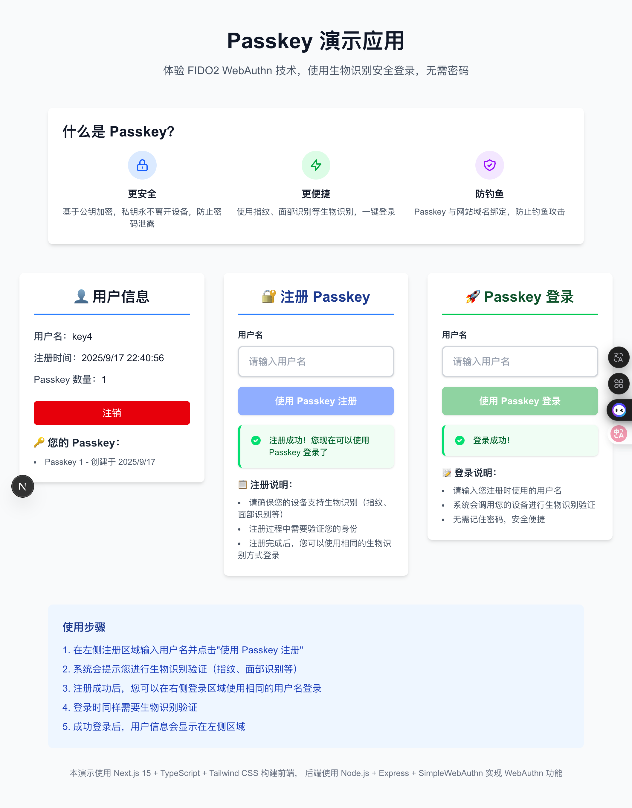

# 🔐 Passkey 演示应用

一个完整的 WebAuthn/FIDO2 Passkey 认证系统演示，支持生物识别登录（Touch ID、Face ID、Windows Hello），无需密码的安全认证体验。



## 📋 项目背景

Passkey 是基于 FIDO2/WebAuthn 标准的下一代身份认证技术，提供了比传统密码更安全、更便捷的用户体验：

- **🔒 更安全**：基于公钥加密，私钥不离开设备，防止密码泄露
- **⚡ 更便捷**：使用指纹、面部识别等生物识别，一键登录
- **🛡️ 防钓鱼**：Passkey 与网站域名绑定，防止钓鱼攻击
- **🌍 跨平台**：支持 iOS、Android、Windows、macOS 等主流平台

本项目展示了如何从零开始构建一个完整的 Passkey 认证系统，包含用户注册、登录、会话管理等核心功能。

## 🛠 技术栈

### 后端
- **Node.js + Express** - 服务端框架
- **TypeScript** - 类型安全
- **原生 WebAuthn 实现** - 无第三方依赖的 FIDO2 支持
- **基于文件的 JSON 存储** - 简化演示，易于理解

### 前端
- **Next.js 15** - React 全栈框架
- **TypeScript** - 类型安全的前端开发
- **Tailwind CSS** - 现代化 UI 设计
- **原生 Web Crypto API** - 浏览器内置加密支持

## 🚀 快速开始

### 前置要求

- Node.js 18+ 
- 支持 WebAuthn 的浏览器（Chrome 67+、Firefox 60+、Safari 14+）
- 支持生物识别的设备（Touch ID、Face ID、Windows Hello、指纹识别器等）

### 安装运行

1. **克隆仓库**
```bash
git clone git@github.com:copyboy/passkey-demo.git
cd passkey-demo
```

2. **启动后端服务**
```bash
cd app
npm install
npm run dev
```
后端服务将运行在 `http://localhost:3001`

3. **启动前端服务**
```bash
cd ui
npm install
npm run dev
```
前端服务将运行在 `http://localhost:3000`

4. **访问应用**
打开浏览器访问 `http://localhost:3000` 开始体验！

## 📱 使用说明

### 注册新用户

1. 在 **"🔐 注册 Passkey"** 区域输入用户名
2. 点击 **"使用 Passkey 注册"** 按钮
3. 系统会提示进行生物识别验证（指纹、面部识别等）
4. 注册成功后，您的 Passkey 将保存在设备中

### 登录已有用户

1. 在 **"🚀 Passkey 登录"** 区域输入用户名
2. 点击 **"使用 Passkey 登录"** 按钮
3. 系统会自动调用您设备的生物识别功能
4. 验证成功后即可登录，查看用户信息

### 用户信息管理

- 登录成功后，可在 **"👤 用户信息"** 区域查看账户详情
- 显示用户名、注册时间、Passkey 数量等信息
- 支持注销登录功能

## 🏗 项目架构

```
passkey-demo/
├── app/                    # 后端服务
│   ├── src/
│   │   ├── controllers/    # 控制器层
│   │   ├── services/       # 业务逻辑层
│   │   ├── storage/        # 数据存储层
│   │   ├── routes/         # 路由定义
│   │   ├── types/          # 类型定义
│   │   └── utils/          # 工具函数
│   ├── data/              # JSON 数据文件
│   └── dist/              # 编译输出
├── ui/                    # 前端应用
│   ├── src/
│   │   ├── app/           # Next.js App Router
│   │   ├── components/    # React 组件
│   │   ├── lib/           # 工具库
│   │   └── types/         # 类型定义
│   └── public/            # 静态资源
└── docs/                  # 文档和截图
```

## 🔧 核心功能实现

### WebAuthn 注册流程

1. **生成注册选项**：服务端创建 challenge 和用户信息
2. **浏览器调用 WebAuthn**：`navigator.credentials.create()`
3. **生物识别验证**：用户进行指纹/面部识别
4. **验证凭证**：服务端验证签名和证书链
5. **存储公钥**：保存用户凭证信息

### WebAuthn 认证流程

1. **生成认证选项**：服务端创建 challenge 和允许的凭证列表
2. **浏览器调用 WebAuthn**：`navigator.credentials.get()`
3. **生物识别验证**：用户进行身份验证
4. **验证签名**：服务端使用公钥验证签名
5. **创建会话**：认证成功后建立用户会话

### 安全特性

- **平台认证器限制**：只允许使用内置生物识别，提升安全性
- **Base64URL 编码**：正确处理 WebAuthn 数据格式
- **会话管理**：安全的用户状态管理
- **错误处理**：完善的异常处理和用户提示

## 🧪 测试场景

### 支持的认证方式

- **macOS**：Touch ID、Touch Bar
- **iOS/iPadOS**：Face ID、Touch ID
- **Windows**：Windows Hello（指纹、面部、PIN）
- **Android**：指纹识别、面部解锁
- **Linux**：FIDO2 安全密钥（可选）

### 浏览器兼容性

| 浏览器 | 版本要求 | 支持状态 |
|--------|----------|----------|
| Chrome | 67+ | ✅ 完全支持 |
| Firefox | 60+ | ✅ 完全支持 |
| Safari | 14+ | ✅ 完全支持 |
| Edge | 18+ | ✅ 完全支持 |

## 📚 API 文档

### 注册相关接口

- `POST /api/auth/register/challenge` - 获取注册选项
- `POST /api/auth/register/verify` - 验证注册凭证

### 认证相关接口

- `POST /api/auth/login/challenge` - 获取登录选项
- `POST /api/auth/login/verify` - 验证登录凭证

### 用户相关接口

- `GET /api/user/info` - 获取用户信息
- `POST /api/auth/logout` - 用户注销

### 健康检查

- `GET /api/health` - 服务健康状态

详细的 API 文档请参考：[docs/API_DOCS.md](docs/API_DOCS.md)

## 🐛 常见问题

### Q: 为什么提示"No passkeys available"？
**A**: 这通常是因为：
1. 用户名不存在或输入错误
2. 该用户没有注册过 Passkey
3. 浏览器不支持 WebAuthn

### Q: 生物识别验证失败怎么办？
**A**: 请检查：
1. 设备是否支持生物识别功能
2. 生物识别是否已在系统中设置
3. 浏览器是否允许访问生物识别功能

### Q: 可以在不同设备间共享 Passkey 吗？
**A**: Passkey 绑定到特定设备，但可以通过以下方式同步：
1. 苹果设备间通过 iCloud 钥匙串同步
2. 谷歌设备间通过 Google Password Manager 同步
3. 每个设备单独注册 Passkey

## 🔮 未来计划

- [ ] 添加多 Passkey 支持（一个用户多个设备）
- [ ] 实现 Passkey 管理界面（查看、删除凭证）
- [ ] 添加数据库支持（PostgreSQL/MySQL）
- [ ] 支持跨设备 Passkey（通过 QR 码）
- [ ] 添加用户头像和个人资料管理
- [ ] 实现管理员后台
- [ ] 添加审计日志功能

## 🤝 贡献指南

欢迎提交 Issue 和 Pull Request！

1. Fork 本仓库
2. 创建特性分支：`git checkout -b feature/your-feature`
3. 提交更改：`git commit -am 'Add some feature'`
4. 推送分支：`git push origin feature/your-feature`
5. 提交 Pull Request

## 📄 开源协议

本项目采用 [MIT 协议](LICENSE) 开源。

## 🙏 致谢

- [WebAuthn 规范](https://w3c.github.io/webauthn/) - W3C 标准
- [FIDO Alliance](https://fidoalliance.org/) - FIDO2 标准制定
- [Next.js](https://nextjs.org/) - React 全栈框架
- [Tailwind CSS](https://tailwindcss.com/) - 现代化 CSS 框架

---

**⭐ 如果这个项目对您有帮助，请给个 Star！**

更多技术细节和实现原理，请查看项目源码和相关文档。